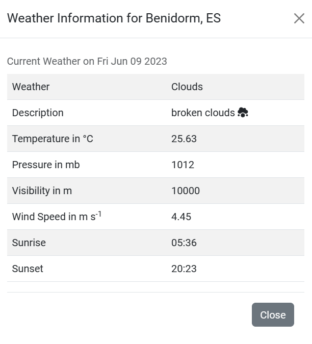
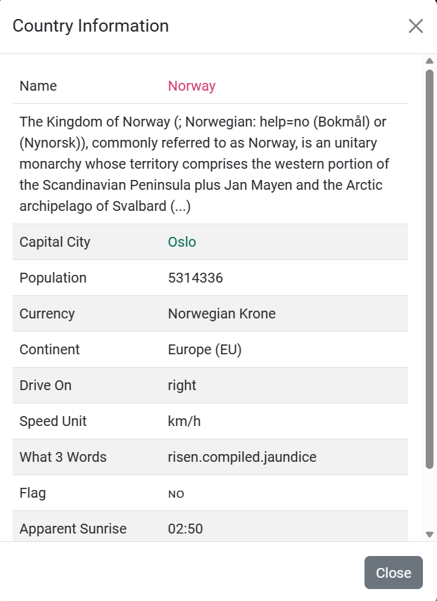
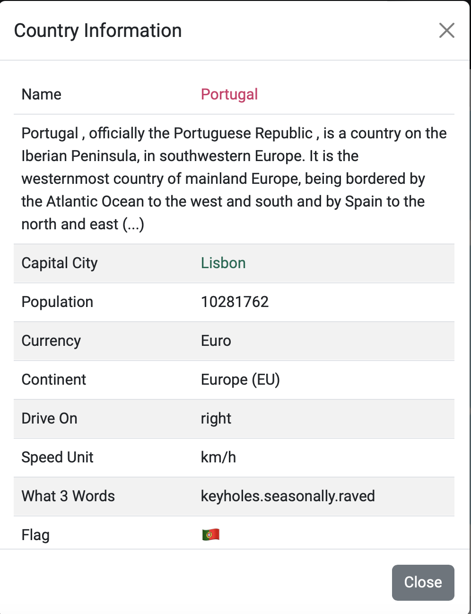
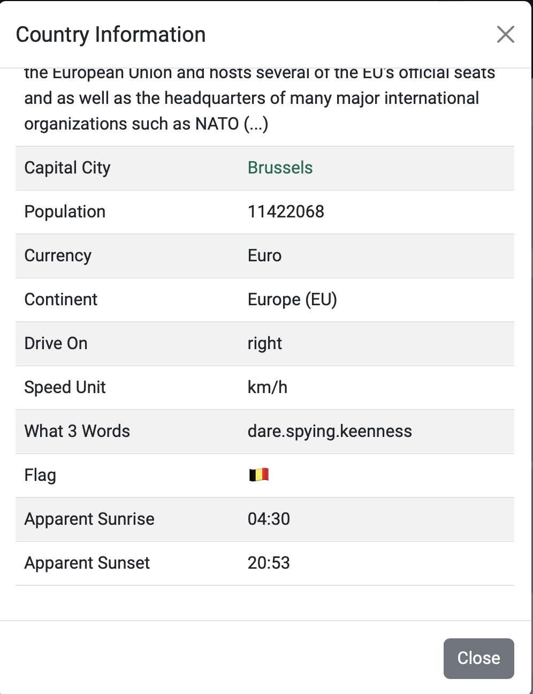

# Gazetteer Project

The aim is to provide an interactive map with the capabilities of searching a country, place or attraction (e.g. park).

## UX

**Information**

- [Current Forecast on Open Weather](Data/openweathercurrent.pdf)
- [Future Forecasts on Open Weather](Data/openweatherfuture.pdf)
- [Open Exchange Rates](Data/openexchangerates.pdf)

An example of the current weather for Benidorm, ES (Spain) was taken on 9 June 2023.  Metric Units are applied.

An example of the future weather forecast for Wisbech, GB (United Kingdom) was taken on 12 June 2023.  Metric Units are applied.

An example of country information for Norway on 13 June 2023.

An example of country information for Portugal on 13 June 2023.

An example of country information for Belgium on 13 June 2023.

An example of the description of an earthquake

## Technologies

HTML5, CSS3, JavaScript, jQuery, Bootstrap, PHP, LeafletJS with Easy Button and Marker Clusters

## Credits

### Media

Images taken from [pngegg.com](https://www.pngegg.com)

### Acknowledgements

- [Open Weather Map](https://openweathermap.org)