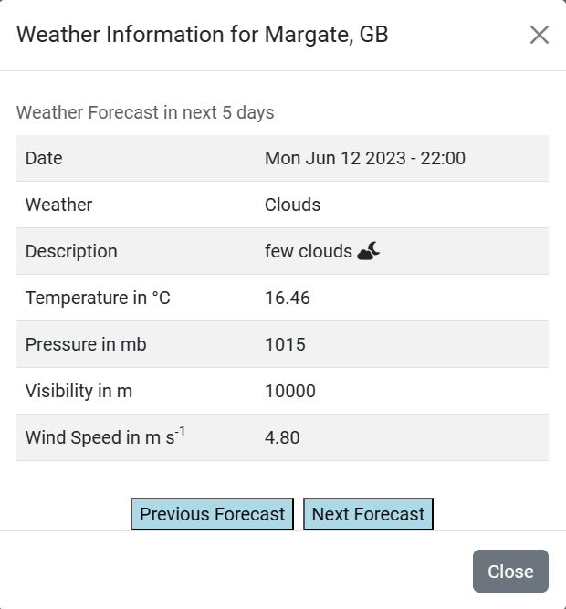

# Gazetteer Project

The aim is to provide an interactive map with the capabilities of searching a country, place or attraction (e.g. park).

## UX

** Information **

- [Current Forecast on Open Weather](Data/openweathercurrent.pdf)
- [Future Forecasts on Open Weather](Data/openweatherfuture.pdf)

## Technologies

HTML5, CSS3, JavaScript, jQuery, Bootstrap, PHP, LeafletJS with Easy Button

## Credits

### Media

Images taken from [pngegg.com](https://www.pngegg.com)

### Acknowledgements

- [Open Weather Map](https://openweathermap.org)