# Gazetteer Project

The aim is to provide profiling of countries through the presentation of demographic, climatic, geographic and other data.  There will be an interactive map with the capabilities of searching a country, place or attraction (e.g. park).

## UX

**User Stories**

As a user, I expect at least the following data:

- Country Name/Capital City (e.g. United Kingdom/London)
- Population
- Currency/Current Exchange Rate
- Current Weather/Weather Forecast
- Wikipedia Links

**Getting Started**

This project checks for Geolocation.

When Geolocation has been enabled, the dropdown list for Select A Country is Updated.  The country border for that country is displayed.  For example, if the user's location is United Kingdom, then United Kingdom is the current selection in the Select a Country dropdown list. The selected country is United Kingdom.  Information on the map for the selected country is displayed (e.g. Earthquakes).

In the Layer Control, the basemaps are Streets, Satellite, Toner and Positron.  Only one basemap can be selected.

The overlays are Eartquakes, Wikipedia Articles, Weather Observations and Cities.  

- Select Get Country Information to Display Country Information (e.g. Name of Country)

- Select Exchange Information to Get Exchange Information.  Allows user to input the amount (number of units from 1 to 1,000,000 in the default currency, e.g. GBP) and the desired currency (e.g. EUR).  When you release the key or change the content of the Amount Field, the result is updated.  When you change the content of the Desired Currency Field, the result is updated.  Result is formatted to 2 decimal places with commas for large numbers (e.g. 1234.56 becomes 1,234.56).  Click on the Clear Button to clear the result.

- Select Weather Information to Get Weather Information.  As well as the current weather, there is also a 3 Day Forecast including today.  If there is an error, it will display `Error Retrieving Weather Information`.

- Select Future Weather to get Future Weather.  Up to 40 readings.  5 day/3 hour forecast.  If there is an error, it will display `Error Retrieiving Future Weather Information`.

- Select Nearby Points of Interest to get Nearby Points of Interest (POI).

- Select Nearby Wikipedia to get Nearby Wikipedia.

- Select Nearby Placename to get Nearby Placename.

- Select Nearby PostalCodes to get Nearby Postal Codes.

You can also search by name of country, city, town, village or landmark (e.g. library, railway station, park).

In the dropdown list, you can select a country (e.g. Australia).  This gives any earthquakes, Wikipedia articles, weather observations and cities.  Hover over one of the icons to get a brief description.  For example, in the weather observations - name of weather station.

**Information**

- [Weather Information for London](Data/weatherinformation.pdf)
- [Open Exchange Rates](Data/openexchangerates.pdf)
- [Open Cage Data for United Kingdom](Data/opencageunitedkingdom.pdf)
- [UK Cities](Data/ukcities.pdf)
- [News Data in United Kingdom Example](Data/newsdataunitedkingdom.pdf)

Information in each PDF is for illustration purposes only.

An example of the weather information for London was taken on 30 August 2023.  For illustration purposes only.

An example of country information for Poland was taken on 27 June 2023.  For illustration purposes only.

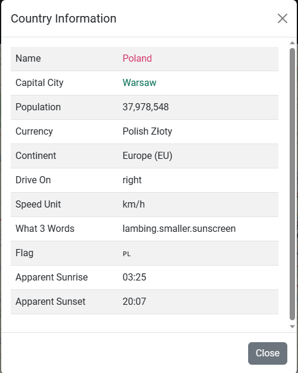

An example of nearby placename with county name omitted on 27 June 2023.

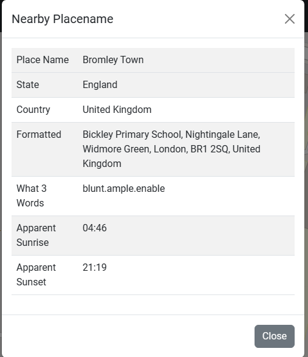

An example of nearby placename with county name shown on 30 June 2023.

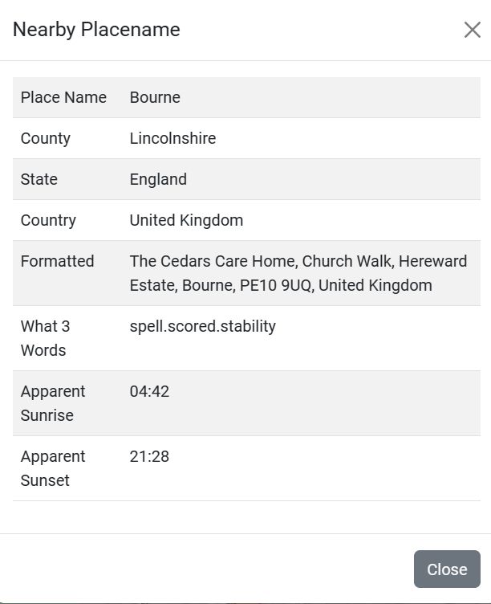

An example of news articles in the United Kingdom on 30 August 2023.  For illustration purposes only.

An example of a description of an earthquake.  For illustration purposes only.

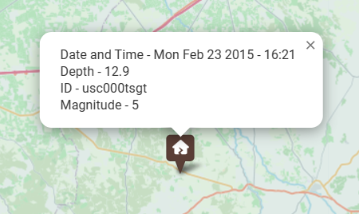

An example of hovering over an earthquake

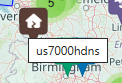

An example of the population of a city.  For illustration purposes only.

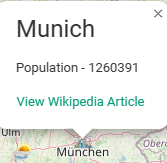

An example of a Weather Observation

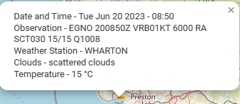

An example of hovering over a Weather Observation

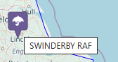

An example of a Wikipedia Article

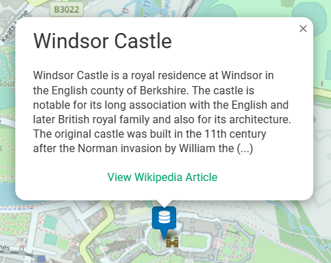

An example of hovering over a Wikipedia Article Icon

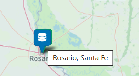

An Example of Nearby Wikipedia.  For illustration purposes only.

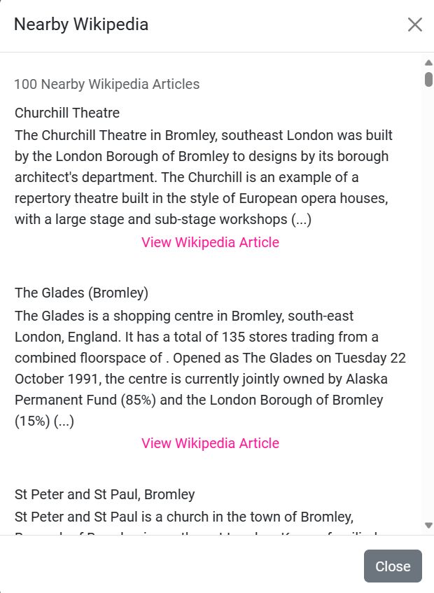

An Example of Nearby Postal Codes (Showing State, County/Province, District).  For illustration purposes only.

An Example of Sea or Ocean (Taken on 4 July 2023)

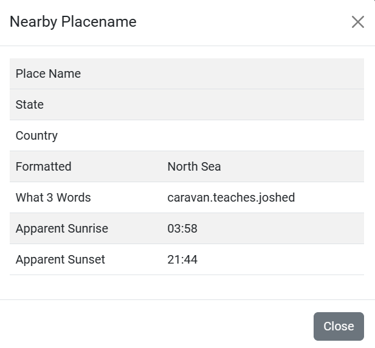

Basemap of Satellite - United Kingdom Map

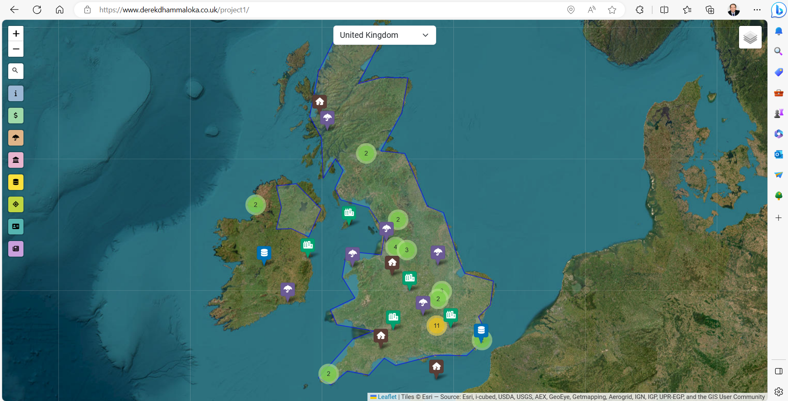

Basemap of Toner - United Kingdom Map

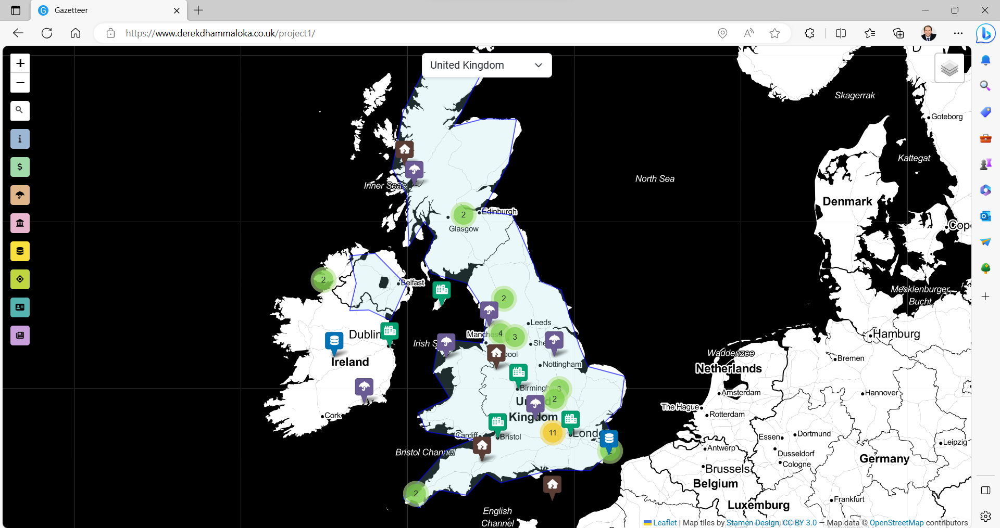

Basemap of Positron - United Kingdom Map

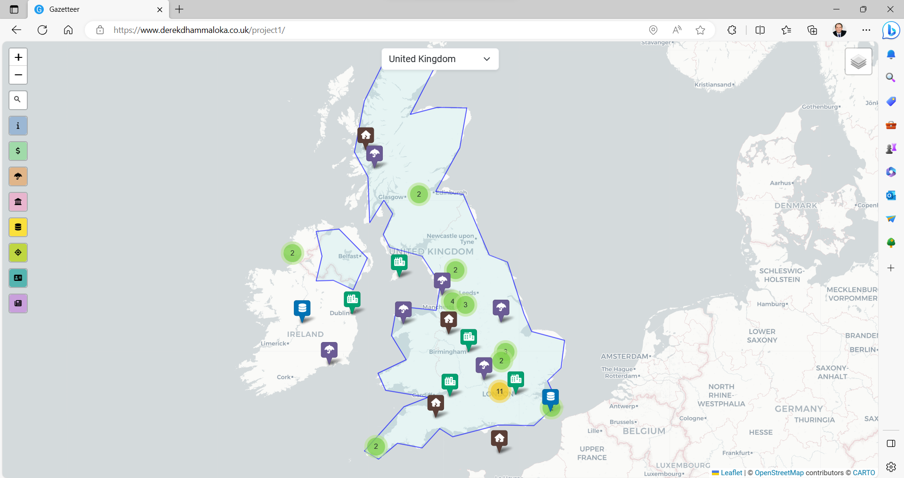

Basemap of Streets - United Kingdom Map

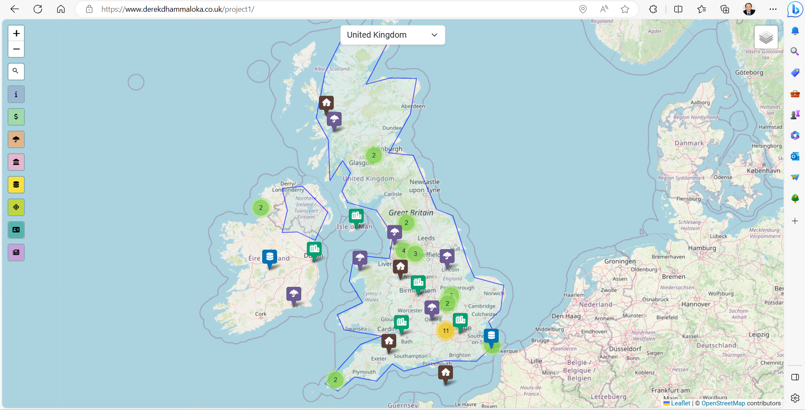

- Country Information (Geonames, Open Cage Data and REST Countries)
- Exchange Information (Open Exchange)
- Current Weather and Forecast Up to 3 Days (WeatherAPI)
- Nearby Points of Interest (Geonames)
- Nearby Wikipedia (Geonames)
- Nearby Placename (Geonames and Open Cage Data)
- Nearby Postal Codes (Geonames)
- News (News Data)

## Features

- Select A Country (e.g. United Kingdom)
- Search a Country, City, Town, Village or Landmark (e.g. Railway Station, Library)
- Get Information on a Country (e.g. Name of Country, Capital City, Population)
- Get Exchange Information (e.g. US Dollars to British Pounds)
- Get Current Weather/Weather Forecast (3 Days)
- Get Nearby Points of Interest (Up to 50)
- Get Nearby Wikipedia (Up to 100 Articles)
- Get Nearby Placename (can include landmark, e.g. library)
- Get Nearby Postal Codes (Up to 100)
- Earthquakes (on Map)
- Wikipedia Articles (with Link, on Map)
- Weather Observations (on Map)
- Cities (with Population and Wikipedia Link, on Map)
- News Articles 

## Technologies

HTML5, CSS3, JavaScript, jQuery, Font Awesome, Bootstrap, PHP, LeafletJS with GeoSearch, Easy Button, Marker Clusters and Extra Markers.  This project makes extensive use of third party APIs (e.g. Open Cage).

## Deployment

Used IONOS to host the website.

[Live Project](https://www.derekdhammaloka.co.uk/project1)

## Credits

### Acknowledgements

- [Weather API](https://www.weatherapi.com/) for Current Weather/Weather Forecast
- [Open Cage Data](https://opencagedata.com) for Country Information, Nearby Placename
- [Open Exchange](https://openexchangerates.org) for Exchange Rates
- [Geonames](https://www.geonames.org) for Country Information, Nearby Wikipedia, Nearby Placename, Timezone Information, Earthquakes, Weather Observations, Wikipedia Articles and Cities
- [News API](https://www.newsdata.io)
- [REST Countries](https://restcountries.com)
- [Stack Overflow](https://www.stackoverflow.com)
- [IONOS](https://www.ionos.co.uk)
- Paddy Evans (Head Tutor, Coding & Systems Devlopment), including CodePen Suggestions
- Nelson Dhalmini (Tutor of IT Career Switch)
- [Corya Silva - Leaflet Extra Markers](https://github.com/coryasilva/Leaflet.ExtraMarkers)
- [Esri](https://www.esri.com) for satellite map
- [Open Street Maps](https://www.openstreetmap.org) including [Copyright Information](https://www.openstreetmap.org/copyright) for Streets, Toner and Positron.

