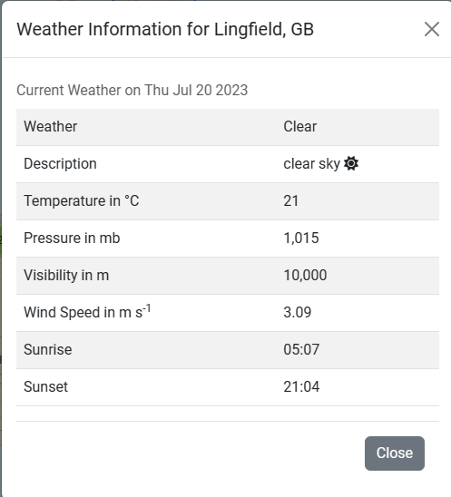
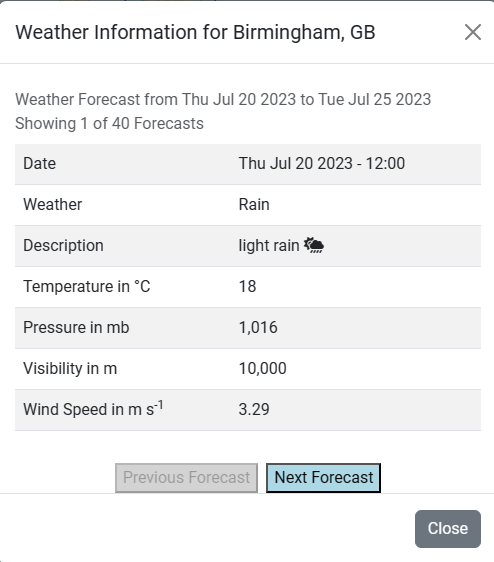
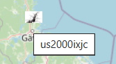
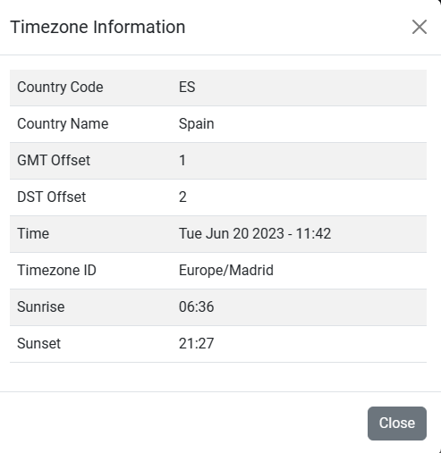
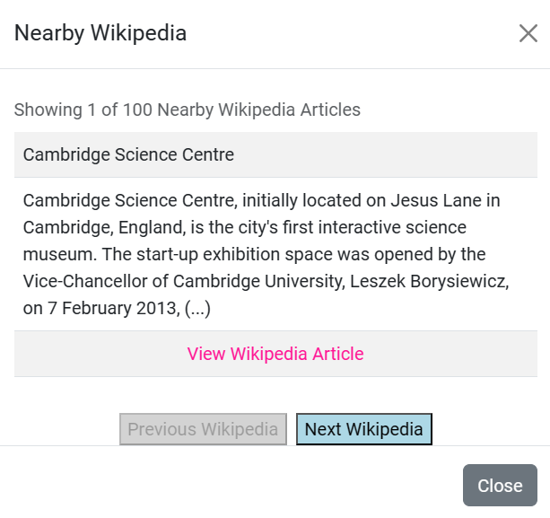

# Gazetteer Project

The aim is to provide profiling of countries through the presentation of demographic, climatic, geographic and other data.  There will be an interactive map with the capabilities of searching a country, place or attraction (e.g. park).

## UX

**User Stories**

As a user, I expect country information to include at least name, capital city, population and currency information.

As a user, I expect current and future weather.

As a user, I expect exchange information.

**Getting Started**

This project checks for Geolocation.

When Geolocation has been enabled, the dropdown list for Select A Country is Updated.  The country border for that country is displayed.  For example, if the user's location is United Kingdom, then United Kingdom is the current selection in the Select a Country dropdown list. The selected country is United Kingdom.  Information on the map for the selected country is displayed (e.g. Earthquakes).

- Select Get Country Information to Display Country Information (e.g. Name of Country)

- Select Exchange Information to Get Exchange Information.  Allows user to input the amount (number of units from 1 to 500 in the default currency, e.g. GBP) and the desired currency (e.g. EUR).  When you release the key or change the content of the Amount Field, the result is updated.  When you change the content of the Desired Currency Field, the result is updated.  Result is formatted to 2 decimal places with commas for large numbers (e.g. 1234.56 becomes 1,234.56).  Click on the Clear Button to clear the result.

- Select Current Weather to get Current Weather.  If there is an error, it will display `Error Retrieving Current Weather Information`.

- Select Future Weather to get Future Weather.  Up to 40 readings.  5 day/3 hour forecast.  If there is an error, it will display `Error Retrieiving Future Weather Information`.

- Select Nearby Wikipedia to get Nearby Wikipedia.

- Select Nearby Placename to get Nearby Placename.

- Select Timezone Information to get Timezone Information.

You can also search by name of country, city, town, village or landmark (e.g. library, railway station, park).

In the dropdown list, you can select a country (e.g. Australia).  This gives any earthquakes, Wikipedia articles, weather observations and cities.  Hover over one of the icons to get a brief description.  For example, in the weather observations - name of weather station.

**Information**

- [Current Forecast on Open Weather](Data/openweathercurrent.pdf)
- [Future Forecasts on Open Weather](Data/openweatherfuture.pdf)
- [Open Exchange Rates](Data/openexchangerates.pdf)
- [Open Cage Data for United Kingdom](Data/opencageunitedkingdom.pdf)
- [UK Cities](Data/ukcities.pdf)

An example of the current weather for Prees, GB (United Kingdom) was taken on 22 June 2023.  Metric Units are applied.

An example of the future weather forecast for Odda, NO (Norway) was taken on 27 June 2023.  Metric Units are applied.

An example of country information for Poland was taken on 27 June 2023.

An example of nearby placename with county name omitted on 27 June 2023.

An example of nearby placename with county name shown on 30 June 2023.

An example of the description of an earthquake in Norway

An example of hovering over an earthquake

An example of the population of a city.  For illustration purposes only.

An example of Timezone Information on 20 June 2023.

An example of a Weather Observation

An Example of Nearby Wikipedia

An Example of Sea or Ocean (Taken on 4 July 2023)

- Country Information (Geonames and Open Cage Data)
- Exchange Information (Open Exchange)
- Current Weather (Open Weather Map)
- Future Weather - up to 5 days (Open Weather Map)
- Nearby Wikipedia (Geonames)
- Nearby Placename (Geonames and Open Cage Data)
- Timezone Information (Geonames)
- News (News API)

## Features

- Select A Country (e.g. United Kingdom)
- Search a Country, City, Town, Village or Landmark (e.g. Railway Station, Library)
- Get Information on a Country (e.g. Name of Country, Capital City, Population)
- Get Exchange Information (e.g. US Dollars to British Pounds)
- Get Current Weather
- Get Future Weather (Up to 5 days)
- Get Nearby Wikipedia (Up to 100 Articles)
- Get Nearby Placename (can include landmark, e.g. library)
- Get Timezone Information
- Earthquakes (on Map)
- Wikipedia Articles (with Link, on Map)
- Weather Observations (on Map)
- Cities (with Population and Wikipedia Link, on Map)
- News Articles 

To do - register with a Tile Provider (e.g. ESRI).

## Technologies

HTML5, CSS3, JavaScript, jQuery, Font Awesome, Bootstrap, PHP, LeafletJS with GeoSearch, Easy Button, Marker Clusters and Extra Markers.  This project makes extensive use of third party APIs (e.g. Open Cage).

## Deployment

Used IONOS to host the website.

[Live Project](https://www.derekdhammaloka.co.uk/project1)

## Credits

### Media

### Acknowledgements

- [Open Weather Map](https://openweathermap.org) for Current and Future Weather Forecasts
- [Open Cage Data](https://opencagedata.com) for Country Information, Nearby Placename
- [Open Exchange](https://openexchangerates.org) for Exchange Rates
- [Geonames](https://www.geonames.org) for Country Information, Nearby Wikipedia, Nearby Placename, Timezone Information, Earthquakes, Weather Observations, Wikipedia Articles and Cities
- [News API](https://newsapi.org)
- [Stack Overflow](https://www.stackoverflow.com)
- [IONOS](https://www.ionos.co.uk)
- Paddy Evans (Head Tutor, Coding & Systems Devlopment), including CodePen Suggestions
- Nelson Dhalmini (Tutor of IT Career Switch)
- [Corya Silva - Leaflet Extra Markers](https://github.com/coryasilva/Leaflet.ExtraMarkers)
- [Esri](https://www.esri.com) for streets, satellite and topographical maps