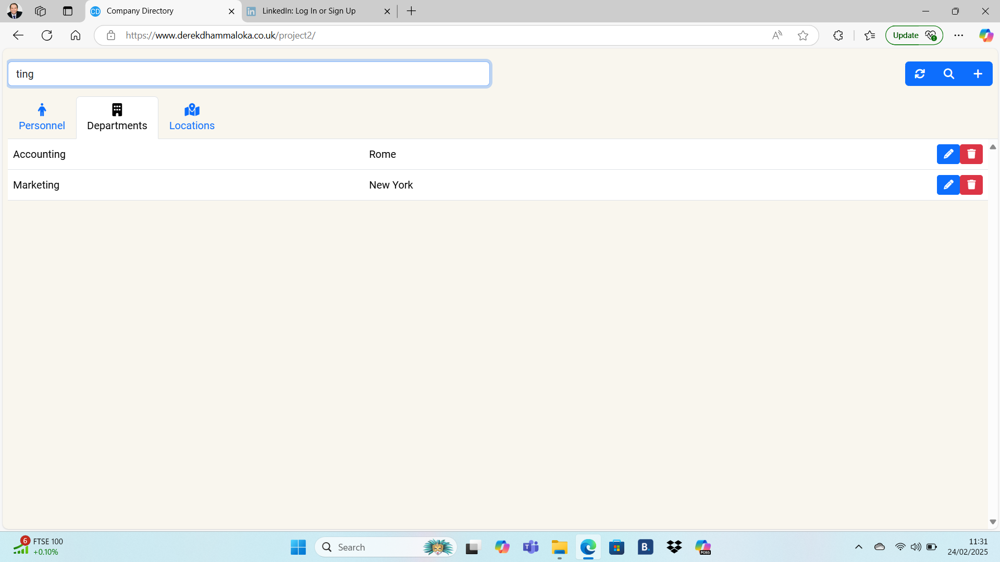

# Company Directory

The aim is to provide a company directory that allows the user to create, read, update and delete employees (personnel), departments and locations.

## UX

Database Structure

The user interface should ask for a confirmation.

Add Location Modal (For Illustration Purposes Only)

Example of Audit Log (For Illustration Purposes Only)

Example of Personnel Table (For Illustration Purposes Only)

Example of Personnel Table with Search Applied (For Illustration Purposes Only)

Example of Departments Table (For Illustration Purposes Only)

Example of Departments Table with Search Applied (For Illustration Purposes Only)

Example of Locations Table (For Illustration Purposes Only)

Examples of Locations Table with Search Applied (For Illustration Purposes Only)

Example of Personnel Table with Add Employee Modal (For Illustration Purposes Only)

Example of Departments Table with Add Department Modal (For Illustration Purposes Only)

Example of Locations Table with Add Location Modal (For Illustration Purposes Only)

Example of Personnel Table with Edit Employee Modal (For Illustration Purposes Only)

## Technologies

Uses HTML5, CSS3, JavaScript, PHP, SQL, jQuery 3.7.1, Bootstrap 5.3.2 and Font Awesome 6.4.2

## Deployment

Used IONOS to host the website.  A virtual private server has been set up.  

- The A and AAAA records have been modified to point to the virtual private server (VPS).  It is a good idea to make a note of the current DNS records before making any changes.  Take a screenshot or write down the details of the A and AAAA records, including the IP addresses.  
- A LAMP Stack has been created.
    - Include MariaDB and Common PHP Modules such as PHP-Curl.
    - To test PHP scripts with Apache, create `info.php` using the command `sudo nano /var/www/yourdomain/info.php`, replacing `yourdomain` with the name of your domain.
    - Paste the following PHP code into the file `<?php phpinfo(); ?>`
    - In the browser address bar enter `http://www.yourdomain/info.php` to see the PHP information.  Print it out (PDF or paper).
    - Once the PHP information has been printed out, delete `info.php`, using `sudo rm /var/www/yourdomain/info.php`.
- Firewall Policies have been set up (e.g. Allow Port 3306)
- Log on to MariaDB, using the command `sudo mariadb -u root -p`.  Once in MariaDB, create a user other than `root`.  Grant privileges to the user that has just been created.
- Make sure the configurations in `config.php` are updated and the credentials are set correctly.  On a Virtual Machine (VPS), Host is set to `127.0.0.1` and the user is set to anyone other than `root`, for example `cduser`, with privileges such as adding records.
- Let's Encrypt Certificate has been installed.

Any future databases, create new user (other than root) and new database.  Enter `use mydatabase`, replacing `mydatabase` is the name of the database you want to use.  Either use `source mydatabase.sql;` or create table(s) from scratch.

**Logging in to the VPS**

- If using Windows, open `Command Prompt`.  If using Mac or Linux, open `Terminal`.
- Type the command `ssh root@youripaddress`, where `youripaddress` is your IP address.
- You will be asked to enter the password

**Logging out of the VPS**

- In `Command Prompt` (Windows) or `Terminal` (Mac/Linux) type the command `exit`

**Keeping the VPS Up To Date**

Use Commands

- `sudo apt update`
- `sudo apt upgrade`

**Digital Ocean Tutorials**

References to Ubuntu 22.04 also apply to Ubuntu 24.04.

- [Securing Apache with Let's Encrypt on Ubuntu](https://www.digitalocean.com/community/tutorials/how-to-secure-apache-with-let-s-encrypt-on-ubuntu)
- [Installing Apache Web Server on Ubuntu 22.04](https://www.digitalocean.com/community/tutorials/how-to-install-the-apache-web-server-on-ubuntu-22-04)

Apache Default Welcome Page (For Illustration Purposes Only)

Successful Installation of LAMP Stack

## Acknowledgements

- [Market Splash](https://www.marketsplash.com)
- [Sitepoint](https://www.sitepoint.com)
- [Digital Ocean](https://www.digitalocean.com)
- [SaturnCloud](https://saturncloud.io/blog/how-can-i-validate-an-email-address-using-a-regular-expression/)